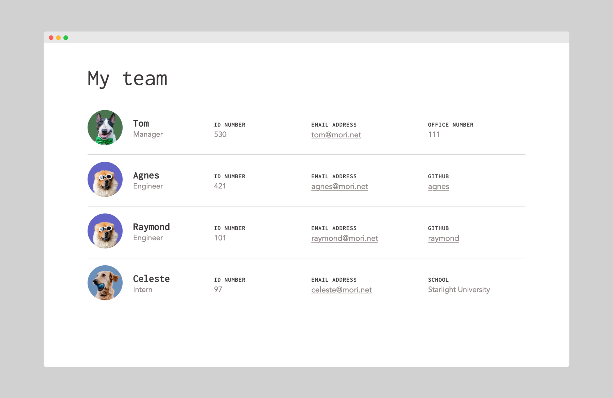

# Team Profile Generator



https://user-images.githubusercontent.com/15278020/132256283-102562ac-b5ed-4137-8fb9-e96934cd08a4.mp4

## Description
The Team Profile Generator is a command-line application that generates a team profile webpage for an engineering team. It uses [Inquirer](https://www.npmjs.com/package/inquirer) to ask a series of questions to populate an HTML file with team member information. When starting the application, the user will be prompted to enter the team manager’s name, employee ID, email address, and office number.

The user will then be presented with a menu with options to add an engineer, add an intern, or to finish building their team. If they choose "Add an engineer", they will be prompted to enter the engineer’s name, ID, email, and GitHub username, and then be taken back to the menu. 

If they choose "Add an intern", they will be prompted to enter the intern's name, ID, email, and school, and then be taken back to the menu. If the user chooses to finish building their team, they will exit out of the prompts and an `index.html` file will be generated that contains the team member information that was entered.

An avatar image will be added for each team member based on their role type.

## Usage
You will need to have [Node](https://nodejs.org/en) installed. Then install the dependencies with:
```
npm install
```
To run the application, type:
```
node index
```
An `index.html` file will be generated in the `dist` folder. The `styles.css` file and the `assets` folder will also be copied over from `src`. View the current `dist` folder for a sample output.

## Credits
* [avatars.lol](https://www.avatars.lol)
* [Inquirer](https://www.npmjs.com/package/inquirer) 
* [fs-extra](https://www.npmjs.com/package/fs-extra)

